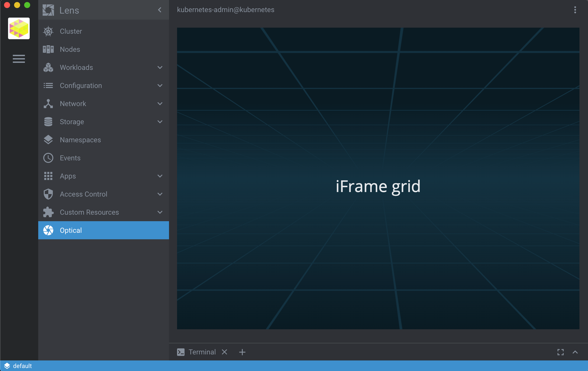
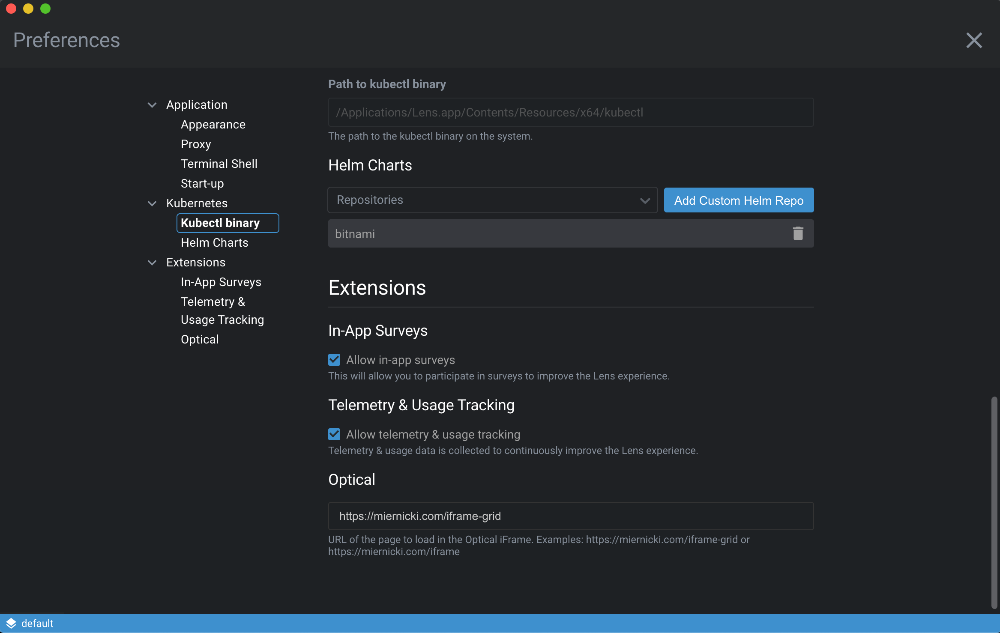

# Optical

Simple [Lens](https://k8slens.dev) extension that presents an iFrame of web content like a dashboard.



It is configurable via Lens' preferences page.


  

## Build

To build the extension you can use `make` command:

```sh
make build
```
  

## Install

To install this extension after it was built successfully follow by a restart of Lens:

```sh
make install
```
  

## Uninstall

To uninstall this extension after it was installed:

```sh
make uninstall
```
  

## Dev

If you want to watch for any source code changes and automatically rebuild the extension you can use:

```sh
make dev
```
